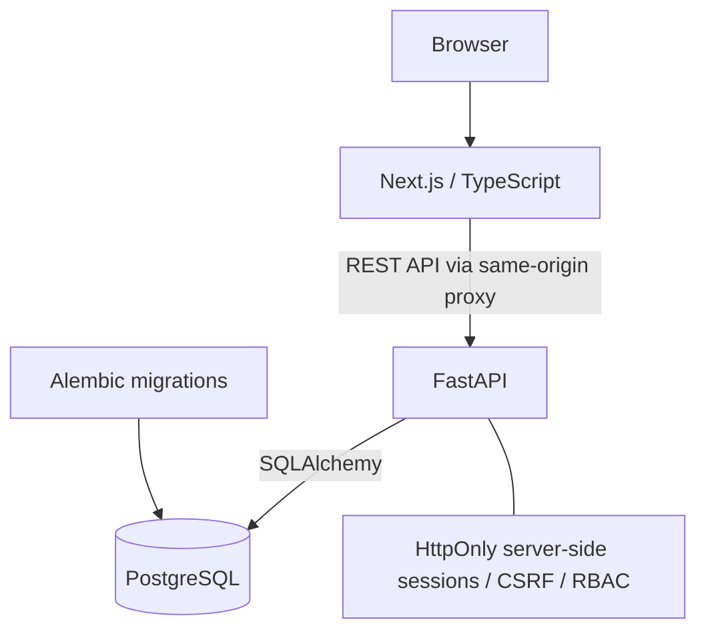

# AXIOM

**Interactive Teaching and Learning Support Platform for Discrete Mathematics I**

AXIOM brings structured question authoring, quiz practice and student progress
into one course workspace. It helps teaching staff reuse mathematical problems
and gives students a place to practise, review solutions and follow their activity.

Developed by **Toghrul Hasanli** as an academic internship software project in the
context of ELTE Faculty of Informatics and Discrete Mathematics I. This is not an
official ELTE production system and does not imply institutional endorsement.

## Status

Implemented through **M6A/M6B Student Progress Tracking**, with **AXIOM Design v1**.
The application runs locally. Public deployment is being prepared; no hosted demo
is advertised here. Planned tools are clearly labeled placeholders.

## Features and roles

- Structured Question Bank with course topics, response types and skill taxonomy.
- Quiz composition, saved student attempts and immutable question snapshots.
- Mathematical Unicode answer input, objective grading, results and solution review.
- Progress overview, topic/skill performance and recent completed attempts.
- Session authentication, server-enforced role checks and private attempt ownership.

| Role | Implemented capabilities |
| --- | --- |
| Student | Register, take/resume quizzes, review submitted attempts and view personal progress |
| Demonstrator | Manage Question Bank resources and quizzes |
| Lecturer | Staff teaching tools; promote Students to Demonstrators and manage their active status |
| Admin | Staff teaching tools and Lecturer/account management under the existing role rules |

Public registration creates Students only. The first Admin is bootstrapped through
a local command. Written responses are saved and shown with reference solutions;
they are **not automatically graded**. Auto-graded practice accuracy is not an exam
grade: it includes answered objective questions with a stored correctness result,
excludes ungraded responses and returns no score when there is no graded data.

## Screenshots

Screenshots are not yet included. Planned portfolio captures:

- Student Dashboard and Progress page
- Question Bank and Quiz Management
- Quiz attempt and completed review

Use synthetic course content and hide personal account details before adding images.

## Architecture



The browser uses the existing authenticated API client; FastAPI enforces ownership
and permissions. PostgreSQL stores users, course resources and attempt snapshots.
Progress is calculated from submitted attempt data, not mutable question records.

**Stack:** Next.js, TypeScript, Tailwind CSS and shared CSS; FastAPI, PostgreSQL,
SQLAlchemy, Psycopg and Alembic. Passwords use Argon2id hashing.

## Implemented milestones

| Milestone | Scope |
| --- | --- |
| M1 | FastAPI/PostgreSQL foundation, migrations and Question CRUD |
| M2 | Frontend course and teaching workspace |
| M3 | Topic hierarchy, response types, skills and structured questions |
| M4 / M4.1 | Student quizzes, snapshots, results/review and mathematical input |
| M5 | Authentication, roles, staff management and attempt ownership |
| M6A / M6B | Progress analytics backend and Student Progress frontend |
| Design v1 | Shared AXIOM navy, gold/champagne and ivory design |

See [M5 authentication](docs/milestone-5-authentication.md),
[M6A analytics](docs/milestone-6a-progress-analytics.md) and
[M6B frontend](docs/milestone-6b-progress-frontend.md). Earlier milestone documents
record the project's development history; their historical scope is not the current feature list.

## Repository structure

```text
backend/
  app/          Models, schemas, routes, services and explicit local scripts
  alembic/      Versioned schema migrations
  tests/        Unit and PostgreSQL integration tests
frontend/
  src/app/      Next.js routes and shared styles
  src/components/  Course, quiz, authentication and progress UI
  src/lib/      Typed API clients and frontend utilities
docs/           Architecture and milestone verification notes
```

## Local development

Prerequisites: Python 3.11+, PostgreSQL (verified locally with 18), Node.js 20.9+
and pnpm (version specified in `frontend/package.json`). The commands below use
PowerShell; on other systems use `.venv/bin/python` instead.

Create a local PostgreSQL role and database; the example configuration uses
`dmi_app` and `dmi_platform`. Give that role ownership/migration privileges locally.
Do not put database passwords in command history or source code.

From the repository root:

```powershell
cd backend
python -m venv .venv
.\.venv\Scripts\python.exe -m pip install -r requirements-dev.txt
# Only create .env if it does not already exist:
if (!(Test-Path .env)) { Copy-Item .env.example .env }
```

Set `DATABASE_PASSWORD` privately in `backend/.env`; adjust the documented local
host, port, database and role as needed. Then:

```powershell
.\.venv\Scripts\python.exe -m alembic upgrade head
.\.venv\Scripts\python.exe -m uvicorn app.main:app --host 127.0.0.1 --port 8000 --reload
```

In another terminal, from the repository root:

```powershell
cd frontend
pnpm install --frozen-lockfile
if (!(Test-Path .env.local)) { Copy-Item .env.example .env.local }
pnpm dev
```

Open the frontend at `http://127.0.0.1:3000`; API documentation is at
`http://127.0.0.1:8000/docs`. `API_BASE_URL` points the frontend proxy to FastAPI.
See [backend instructions](backend/README.md) and [frontend instructions](frontend/README.md).

### Migrations and local accounts

Apply migrations before running the application; current head is `0006`. Tables
are not created automatically at startup. Inspect schema state with
`python -m alembic current` and `python -m alembic check` using the backend environment.

Bootstrap the first Admin from `backend` with
`python -m app.scripts.create_admin`; it prompts privately for credentials.
Optional demo seeding uses `python -m app.scripts.seed_demo_users --local-development`.
It also requires `DEMO_SEED_ENABLED=true` and all four `DEMO_*_PASSWORD` values in
local configuration. No demo passwords ship in source. Never run or enable demo
seeding in production; it is not called at startup or by migrations.

## Testing

From `backend`, with the virtual environment installed and migrations applied:

```powershell
$env:RUN_POSTGRES_TESTS = '1'
.\.venv\Scripts\python.exe -m pytest -q
Remove-Item Env:RUN_POSTGRES_TESTS
```

Use a disposable development/test PostgreSQL database. Integration tests create
and remove their own fixtures and a temporary migration-test schema; sequences
may advance. Without the opt-in variable, PostgreSQL tests are skipped.

From `frontend`:

```powershell
pnpm lint
pnpm typecheck
pnpm build
```

## Security and deployment

Authentication uses revocable server-side sessions with HttpOnly cookies,
SameSite protections and CSRF checks for protected mutations. Authorization and
attempt ownership are enforced by the backend. Environment files and local
secrets are ignored; examples contain safe defaults and empty password fields.

Public deployment is being prepared, not performed by this repository cleanup.
Production setup must provide HTTPS, secure cookies, appropriate allowed origins,
private database credentials and operational backups. The current authentication
rate limiter is process-local; production hardening remains an explicit deployment
concern. See the M5 guide for known limitations. Do not publish local database
exports, demo credentials or personal student data.

## Roadmap

Planned, **not implemented**: staff manual grading/review, Exam Builder, Practice
Sheet Generator, Question Generator, solution/variant generation, LaTeX/PDF tools,
course material tools and advanced visualizations.

## Author and licensing

**Toghrul Hasanli** — academic internship software project, ELTE Faculty of Informatics context.

No public software license has been added. Licensing and any applicable academic
or course-content permissions remain for the repository owner to decide before
or after publication; public visibility alone does not grant reuse rights.
